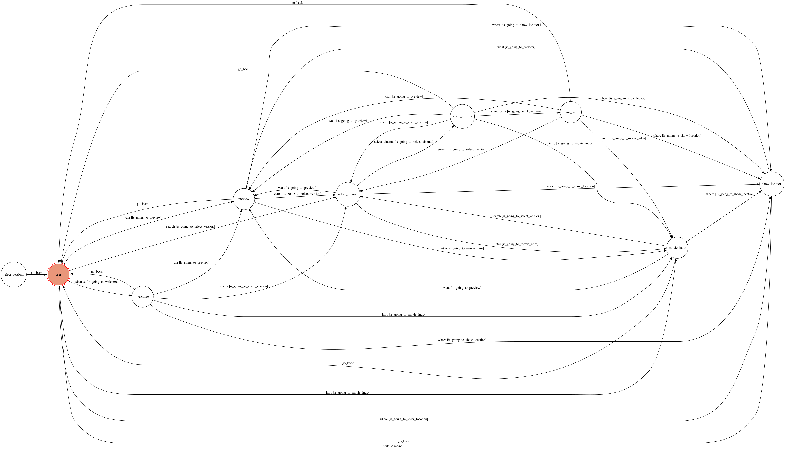

# 威秀小幫手

Line Bot Code for TOC Project 2020

A Line bot based on a finite state machine


## 功能簡介

### 歡迎訊息


<br><br/>

### 影城據點查詢


<br><br/>

### 熱映中電影


<br><br/>

### 電影劇情簡介


<br><br/>

### 電影版本選擇


<br><br/>

### 影城選擇


<br><br/>

### 時刻表顯示


## Finite State Machine


## Message Type

1. Text Message:
   <br><br/>
   回傳文字訊息給user，「歡迎訊息」、「電影劇情簡介」、「時刻表顯示」均用text message回覆。
   <br><br/>
2. Flex Message:
    <br><br/>
   可自行設計回覆的內容樣式，不拘束於line提供的template格式，「影城據點查詢」、「熱映中電影」、「電影版本選擇」、「影城選擇」都是用Flex Message回覆。使用Line Developer的Flex Message Simulator設計，點選元件後可以直接從右方修改屬性，左方能立即產生UI。
   
   <br><br/>
   完成設計後可按View as JSON，產生的JSON code可加入python程式裡，透過json.dumps()和json.loads()將JSON code轉換成python line bot sdk裡FlexSendMessage可以接受的dict。
   ```
    bubble_string={
        'type': 'bubble',
        'direction': 'ltr',
        'hero': {
            'type': 'image',
            'url': 'https://example.com/cafe.jpg',
            'size': 'full',
            'aspectRatio': '20:13',
            'aspectMode': 'cover',
            'action': { 'type': 'uri', 'uri': 'http://example.com', 'label': 'label' }
        }
    }
	s1 = json.dumps(bubble_string)
    s2 = json.loads(s1)
    flex_message = FlexSendMessage(alt_text='hello',contents=s2)
	```
## Postback Event
因為每個state必須知道上個state使用者的選擇，例如：按下「熱映中電影」的「時刻表」按鈕後，bot必須知道使用者按的是哪部電影的「時刻表」按鈕，才能再繼續找到該電影提供的版本，並再找到該版本放映的地點，因此我把button的action做成postback，利用postback.data把使用者的選擇透過postback event傳給往後的state。
```
"type": "button",
        "action": {
            "type": "postback",
            "label": "簡介",
            "text": name[i]+"簡介",
            "data":"intro"+introduction[i]
        }
```
## Web Crawling
使用BeautifulSoup套件實作華納威秀官網的爬蟲，從 https://www.vscinemas.com.tw/vsweb/film/index.aspx 得到熱映中電影的圖片(藍框處)、名字和通往電影詳情的網址(紅框處)。


<br><br/>
在電影詳情的網頁得到電影的放映版本(紅框處)和對應的放映影廳(藍框處)


<br><br/>
同樣在電影詳情的網頁，選擇放映影廳後得到該影廳的的放映日期(紅框處)和放映時間(藍框處)


<br><br/>
在影城介紹的網頁https://www.vscinemas.com.tw/vsweb/theater/index.aspx 裡得到各地影城的名字地址及電話(紅框處)


## Reference
[Line Messaging API Reference](https://developers.line.biz/en/reference/messaging-api/)

[Line line-bot-sdk-python](https://github.com/line/line-bot-sdk-python)

[爬蟲學習筆記](https://yanwei-liu.medium.com/python%E7%88%AC%E8%9F%B2%E5%AD%B8%E7%BF%92%E7%AD%86%E8%A8%98-%E4%B8%80-beautifulsoup-1ee011df8768)
