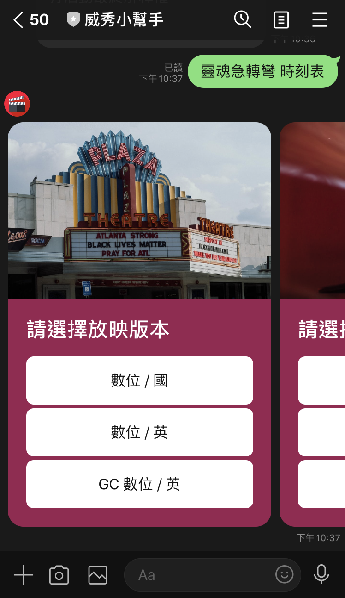
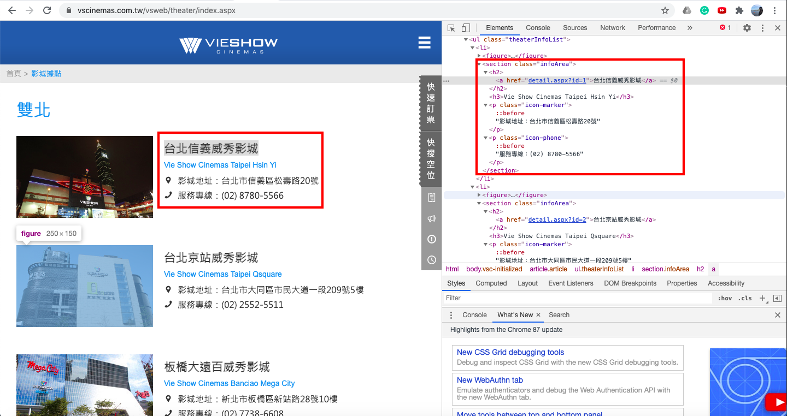

# 威秀小幫手

Line Bot Code for TOC Project 2020

A Line bot based on a finite state machine


## 功能簡介

### 歡迎訊息


<br><br/>

### 影城據點查詢


<br><br/>

### 熱映中電影


<br><br/>

### 電影劇情簡介


<br><br/>

### 電影版本選擇


<br><br/>

### 影城選擇


<br><br/>

### 時刻表顯示


## Finite State Machine


## Message Type

1. Text Message:
   回傳文字訊息給user，「歡迎訊息」、「電影劇情簡介」、「時刻表顯示」均用text message回覆。
2. Flex Message:
   可自行設計回覆的內容樣式，不拘束於line提供的template格式。使用Line Developer的Flex Message Simulator設計，點選元件後可以直接從右方修改屬性，左方能立即產生UI。
   
   <br><br/>
   完成設計後可按View as JSON，產生的JSON code可加入python程式裡，透過json.dumps()和json.loads()將JSON code轉換成轉換成python line bot sdk裡FlexSendMessage可以接受的dict。
   ```
    bubble_string={
        'type': 'bubble',
        'direction': 'ltr',
        'hero': {
            'type': 'image',
            'url': 'https://example.com/cafe.jpg',
            'size': 'full',
            'aspectRatio': '20:13',
            'aspectMode': 'cover',
            'action': { 'type': 'uri', 'uri': 'http://example.com', 'label': 'label' }
        }
    }
	s1 = json.dumps(bubble_string)
    s2 = json.loads(s1)
    flex_message = FlexSendMessage(alt_text='hello',contents=s2)
	```

## Web Crawling
使用BeautifulSoup套件實作華納威秀官網的爬蟲，從 https://www.vscinemas.com.tw/vsweb/film/index.aspx 得到熱映中電影的圖片(藍框處)、名字和通往電影詳情的網址(紅框處)。


<br><br/>
在電影詳情的網頁得到電影的放映版本(紅框處)和對應的放映影廳(藍框處)


<br><br/>
同樣在電影詳情的網頁，選擇放映影廳後得到該影廳的的放映日期(紅框處)和放映時間(藍框處)


<br><br/>
在影城介紹的網頁https://www.vscinemas.com.tw/vsweb/theater/index.aspx 裡得到各地影城的名字地址及電話(紅框處)



* user
	* Input: "go to state1"
		* Reply: "I'm entering state1"

	* Input: "go to state2"
		* Reply: "I'm entering state2"

## Deploy
Setting to deploy webhooks on Heroku.

### Heroku CLI installation

* [macOS, Windows](https://devcenter.heroku.com/articles/heroku-cli)

or you can use Homebrew (MAC)
```sh
brew tap heroku/brew && brew install heroku
```

or you can use Snap (Ubuntu 16+)
```sh
sudo snap install --classic heroku
```

### Connect to Heroku

1. Register Heroku: https://signup.heroku.com

2. Create Heroku project from website

3. CLI Login

	`heroku login`

### Upload project to Heroku

1. Add local project to Heroku project

	heroku git:remote -a {HEROKU_APP_NAME}

2. Upload project

	```
	git add .
	git commit -m "Add code"
	git push -f heroku master
	```

3. Set Environment - Line Messaging API Secret Keys

	```
	heroku config:set LINE_CHANNEL_SECRET=your_line_channel_secret
	heroku config:set LINE_CHANNEL_ACCESS_TOKEN=your_line_channel_access_token
	```

4. Your Project is now running on Heroku!

	url: `{HEROKU_APP_NAME}.herokuapp.com/callback`

	debug command: `heroku logs --tail --app {HEROKU_APP_NAME}`

5. If fail with `pygraphviz` install errors

	run commands below can solve the problems
	```
	heroku buildpacks:set heroku/python
	heroku buildpacks:add --index 1 heroku-community/apt
	```

	refference: https://hackmd.io/@ccw/B1Xw7E8kN?type=view#Q2-如何在-Heroku-使用-pygraphviz

## Reference
[Pipenv](https://medium.com/@chihsuan/pipenv-更簡單-更快速的-python-套件管理工具-135a47e504f4) ❤️ [@chihsuan](https://github.com/chihsuan)

[TOC-Project-2019](https://github.com/winonecheng/TOC-Project-2019) ❤️ [@winonecheng](https://github.com/winonecheng)

Flask Architecture ❤️ [@Sirius207](https://github.com/Sirius207)

[Line line-bot-sdk-python](https://github.com/line/line-bot-sdk-python/tree/master/examples/flask-echo)
